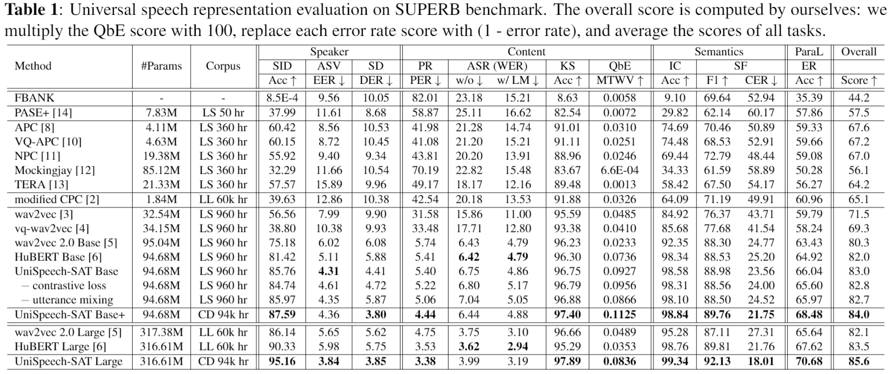

# UniSpeech-SAT

This is the official implementation of paper "[UniSpeech-SAT: Universal Speech Representation Learning with  Speaker Aware Pre-Training](https://arxiv.org/abs/2110.05752)"(```ICASSP 2022 Submission```). The implementation is mainly based on [fairseq](https://github.com/pytorch/fairseq) codebase. 

## Requirements and Installation

 - Pytorch >= 1.6.0
 - python version >= 3.7
 ``` bash
 cd UniSpeech/UniSpeech-SAT
 pip install --editable ./ --user
 ```

## Pre-trained models

Model | Dataset | Model
|---|---|---
UniSpeech-SAT Base |  [960 hrs LibriSpeech](http://www.openslr.org/12) | [download](https://drive.google.com/file/d/1l5etRW6W2aP_8I2Fs_8ailGZqEzdrAPz/view?usp=sharing)
UniSpeech-SAT Base+ | [60k hrs Libri-Light](https://github.com/facebookresearch/libri-light) + [10k hrs GigaSpeech](https://github.com/SpeechColab/GigaSpeech) + [24k hrs VoxPopuli](https://github.com/facebookresearch/voxpopuli/tree/main) | [download](https://drive.google.com/file/d/1Q1MLVfyOHkSzTjyD-mzSZVjhndEmCvef/view?usp=sharing)
UniSpeech-SAT Large | [60k hrs Libri-Light](https://github.com/facebookresearch/libri-light) + [10k hrs GigaSpeech](https://github.com/SpeechColab/GigaSpeech) + [24k hrs VoxPopuli](https://github.com/facebookresearch/voxpopuli/tree/main) | [download](https://drive.google.com/file/d/12ScE1G2W-AHcccyBb_0uVI6qpFVQ0PaI/view?usp=sharing)

## Load pretrained models

Example usage:

```python
import torch
import fairseq

cp_path = '/path/to/unispeech-sat.pt'
model, cfg, task = fairseq.checkpoint_utils.load_model_ensemble_and_task([cp_path])
model = model[0]
model.remove_pretraining_modules()
model.eval()

wav_input_16khz = torch.randn(1,10000)
f = model.extract_features(wav_input_16khz)[0]
```

## Results on [SUPERB](https://superbbenchmark.org/leaderboard)



## Citation
If you find our work useful, please cite [our paper](https://arxiv.org/abs/2110.05752).

